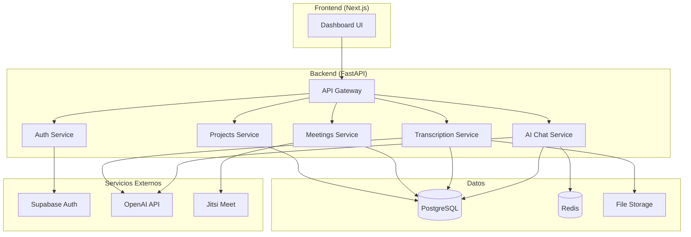

# 🏗️ Propuesta de Arquitectura Backend FastAPI para V1tr0

## 📋 Resumen Ejecutivo

Esta propuesta presenta una arquitectura completa de backend desarrollada en **FastAPI** para complementar el frontend Next.js existente de V1tr0. El sistema está diseñado para manejar la gestión de proyectos, clientes, reuniones, transcripciones de audio con IA y chat contextual inteligente.

## 🎯 Objetivos

### Objetivos Principales
- ✅ **Integración perfecta** con el frontend Next.js existente
- ✅ **Autenticación unificada** usando Supabase
- ✅ **Gestión completa** de proyectos y clientes
- ✅ **Sistema de reuniones** con Jitsi Meet
- ✅ **Transcripciones automáticas** con IA
- ✅ **Chat inteligente** contextual por proyecto

### Objetivos Técnicos
- ⚡ **Alto rendimiento** con FastAPI asíncrono
- 🔒 **Seguridad robusta** con JWT y validación estricta
- 📈 **Escalabilidad** horizontal y vertical
- 🧪 **Testeable** con cobertura completa
- 📚 **Documentación automática** con OpenAPI

## 🏛️ Arquitectura del Sistema

### Stack Tecnológico

| Componente | Tecnología | Justificación |
|------------|------------|---------------|
| **Framework Web** | FastAPI | Alto rendimiento, async nativo, documentación automática |
| **Base de Datos** | PostgreSQL | Robustez, ACID, soporte JSON, escalabilidad |
| **ORM** | SQLAlchemy (async) | Maduro, potente, soporte async completo |
| **Autenticación** | Supabase | Integración existente, OAuth, gestión de usuarios |
| **Cache** | Redis | Velocidad, persistencia opcional, pub/sub |
| **IA** | OpenAI API | Whisper para transcripciones, GPT para chat |
| **Videollamadas** | Jitsi Meet | Open source, escalable, fácil integración |
| **Validación** | Pydantic | Type safety, validación automática, serialización |

### Diagrama de Arquitectura



## 📊 Modelo de Datos

### Entidades Principales

#### 👤 Users
```sql
- id (PK)
- supabase_id (unique)
- email (unique)
- full_name
- avatar_url
- is_active
- is_admin
- created_at, updated_at
```

#### 🏢 Clients
```sql
- id (PK)
- name
- company
- email, phone
- address, city, country
- status (active/inactive/prospect)
- priority (low/medium/high)
- created_by_id (FK)
- created_at, updated_at
```

#### 📋 Projects
```sql
- id (PK)
- title, description
- status (planned/in-progress/completed/on-hold/cancelled)
- progress (0-100)
- priority (low/medium/high/urgent)
- start_date, end_date, deadline
- budget, hourly_rate
- estimated_hours, actual_hours
- client_id (FK), owner_id (FK)
- created_at, updated_at
```

#### 🎥 Meetings
```sql
- id (PK)
- title, description
- room_id (unique)
- start_time, end_time
- status (scheduled/in-progress/completed/cancelled)
- recording_url, recording_status
- project_id (FK), created_by_id (FK)
- created_at, updated_at
```

#### 📝 Transcriptions
```sql
- id (PK)
- transcript_text
- summary, key_points, commitments, next_steps
- processing_status (pending/processing/completed/failed)
- confidence_score
- meeting_id (FK)
- created_at, updated_at
```

#### 💬 Chat Messages
```sql
- id (PK)
- message, ai_response
- message_type (chat/question/command)
- context_used (JSON)
- processing_status
- project_id (FK), user_id (FK)
- created_at, updated_at
```

## 🔌 API Endpoints

### Estructura de URLs
```
/api/v1/
├── auth/
│   ├── login
│   ├── register
│   ├── me
│   └── refresh
├── users/
│   ├── GET,POST /
│   ├── GET,PUT,DELETE /{id}
│   └── GET /{id}/stats
├── clients/
│   ├── GET,POST /
│   ├── GET,PUT,DELETE /{id}
│   └── GET /{id}/projects
├── projects/
│   ├── GET,POST /
│   ├── GET,PUT,DELETE /{id}
│   └── GET /{id}/stats
├── meetings/
│   ├── GET,POST /
│   ├── GET,PUT,DELETE /{id}
│   ├── POST /{id}/join
│   └── POST /{id}/leave
├── transcriptions/
│   ├── GET /
│   ├── POST /upload/{meeting_id}
│   ├── GET /{id}
│   └── POST /{id}/regenerate-summary
└── ai/
    ├── POST /chat/{project_id}
    ├── GET /chat/{project_id}
    ├── GET /ask/{project_id}
    ├── GET /insights/{project_id}
    └── GET /search/{project_id}
```

## 🔒 Seguridad

### Autenticación y Autorización
- **Supabase Integration**: Autenticación unificada con el frontend
- **JWT Tokens**: Tokens seguros con expiración configurable
- **Role-Based Access**: Control granular de permisos
- **API Key Protection**: Claves de API para servicios externos

### Validación y Sanitización
- **Pydantic Schemas**: Validación estricta de tipos
- **SQL Injection Protection**: ORM con prepared statements
- **XSS Prevention**: Sanitización de inputs
- **Rate Limiting**: Protección contra abuso

### Configuración de Seguridad
```python
# CORS configurado para frontend
CORS_ORIGINS = ["http://localhost:3000", "https://v1tr0.com"]

# Headers de seguridad
SECURITY_HEADERS = {
    "X-Content-Type-Options": "nosniff",
    "X-Frame-Options": "DENY",
    "X-XSS-Protection": "1; mode=block"
}
```

## 🤖 Integración con IA

### Transcripciones Automáticas
```python
# Flujo de procesamiento
1. Upload de audio → Validación de formato
2. Envío a OpenAI Whisper → Transcripción
3. Procesamiento con GPT → Resumen y análisis
4. Almacenamiento → Base de datos
5. Notificación → Usuario
```

### Chat Contextual
```python
# Contexto inteligente
- Datos del proyecto actual
- Transcripciones de reuniones
- Historial de chat previo
- Documentos del proyecto
- Métricas y estadísticas
```

## 📈 Rendimiento y Escalabilidad

### Optimizaciones
- **Async/Await**: Operaciones no bloqueantes
- **Connection Pooling**: Gestión eficiente de conexiones DB
- **Redis Caching**: Cache de consultas frecuentes
- **Lazy Loading**: Carga bajo demanda de relaciones
- **Pagination**: Limitación de resultados grandes

### Métricas de Rendimiento Esperadas
- **Latencia API**: < 100ms para operaciones simples
- **Throughput**: > 1000 requests/segundo
- **Transcripción**: ~1 minuto por hora de audio
- **Chat IA**: < 3 segundos respuesta promedio

## 🧪 Testing y Calidad

### Estrategia de Testing
```python
tests/
├── unit/           # Tests unitarios (80% cobertura)
├── integration/    # Tests de integración
├── e2e/           # Tests end-to-end
└── performance/   # Tests de carga
```

### Herramientas de Calidad
- **pytest**: Framework de testing
- **black**: Formateo de código
- **isort**: Organización de imports
- **flake8**: Linting
- **mypy**: Type checking

## 🚀 Despliegue y DevOps

### Containerización
```dockerfile
# Multi-stage build para optimización
FROM python:3.11-slim as base
# ... configuración optimizada
```

### CI/CD Pipeline
```yaml
# GitHub Actions / GitLab CI
1. Tests automatizados
2. Quality checks (linting, type checking)
3. Security scanning
4. Build Docker image
5. Deploy to staging
6. Integration tests
7. Deploy to production
```

### Monitoreo
- **Health Checks**: Endpoints de salud
- **Logging**: Structured logging con Loguru
- **Metrics**: Prometheus/Grafana
- **Error Tracking**: Sentry integration

## 💰 Estimación de Costos

### Desarrollo (Tiempo estimado)
- **Setup inicial**: 1-2 días
- **Autenticación**: 2-3 días
- **CRUD básico**: 3-4 días
- **Sistema de reuniones**: 2-3 días
- **Transcripciones IA**: 3-4 días
- **Chat IA**: 4-5 días
- **Testing y documentación**: 2-3 días
- **Total**: 17-24 días

### Infraestructura (Mensual)
- **Servidor API**: $50-100
- **Base de datos**: $30-60
- **Redis**: $20-40
- **OpenAI API**: $100-300 (variable)
- **Storage**: $10-30
- **Total**: $210-530/mes

## 🔄 Migración y Integración

### Plan de Migración
1. **Fase 1**: Setup básico y autenticación
2. **Fase 2**: Migración de datos existentes
3. **Fase 3**: Integración con frontend
4. **Fase 4**: Features avanzadas (IA, reuniones)
5. **Fase 5**: Optimización y monitoreo

### Compatibilidad con Frontend
- **API Contracts**: Esquemas compatibles con TypeScript
- **Error Handling**: Códigos de error consistentes
- **Response Format**: JSON estructurado estándar
- **WebSockets**: Para actualizaciones en tiempo real (futuro)

## 📋 Próximos Pasos

### Inmediatos (Semana 1-2)
1. ✅ **Setup del proyecto** - Completado
2. ✅ **Configuración de base de datos** - Completado
3. ✅ **Modelos y esquemas** - Completado
4. 🔄 **Endpoints de autenticación**
5. 🔄 **CRUD de proyectos y clientes**

### Corto Plazo (Semana 3-4)
1. 📋 **Sistema de reuniones**
2. 📋 **Transcripciones básicas**
3. 📋 **Chat IA inicial**
4. 📋 **Tests unitarios**

### Mediano Plazo (Mes 2)
1. 📋 **Features avanzadas de IA**
2. 📋 **Optimizaciones de rendimiento**
3. 📋 **Documentación completa**
4. 📋 **Deploy a producción**

## 🎯 Conclusión

Esta arquitectura FastAPI proporciona una base sólida, escalable y moderna para el backend de V1tr0. La integración con Supabase mantiene la consistencia con el frontend existente, mientras que las capacidades de IA añaden valor significativo al producto.

### Ventajas Clave
- 🚀 **Desarrollo rápido** con FastAPI
- 🔒 **Seguridad robusta** desde el diseño
- 🤖 **IA integrada** para transcripciones y chat
- 📈 **Escalabilidad** para crecimiento futuro
- 🧪 **Calidad asegurada** con testing completo

### Riesgos Mitigados
- **Vendor Lock-in**: Uso de tecnologías open source
- **Escalabilidad**: Arquitectura async y cache
- **Seguridad**: Múltiples capas de protección
- **Mantenibilidad**: Código limpio y documentado

**¿Estás listo para comenzar la implementación?** 🚀